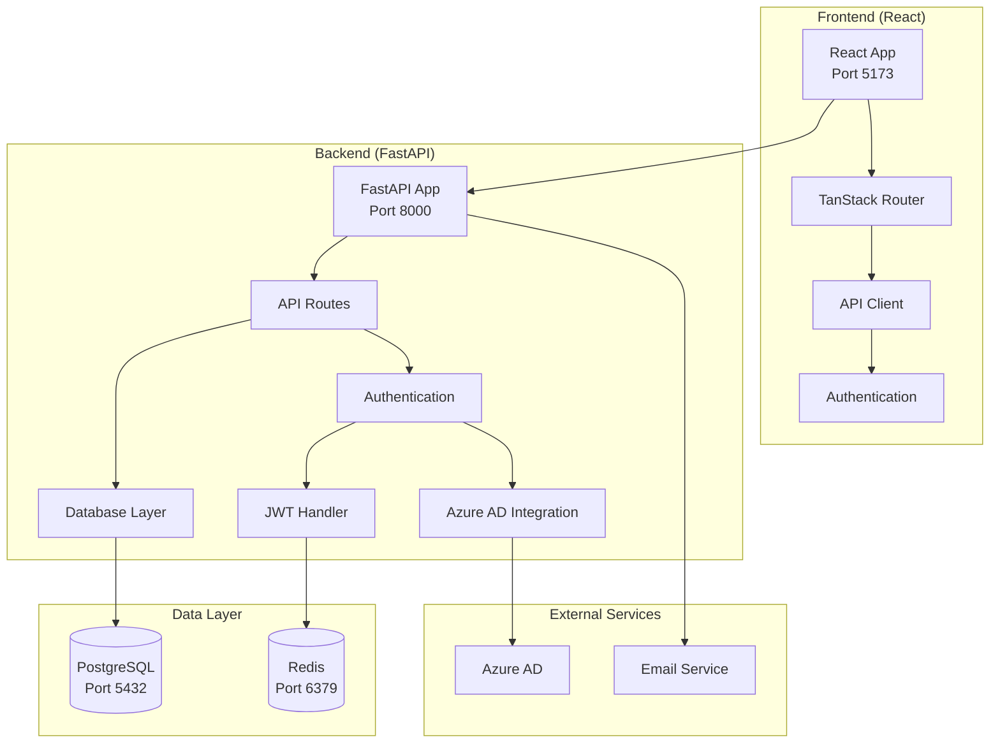
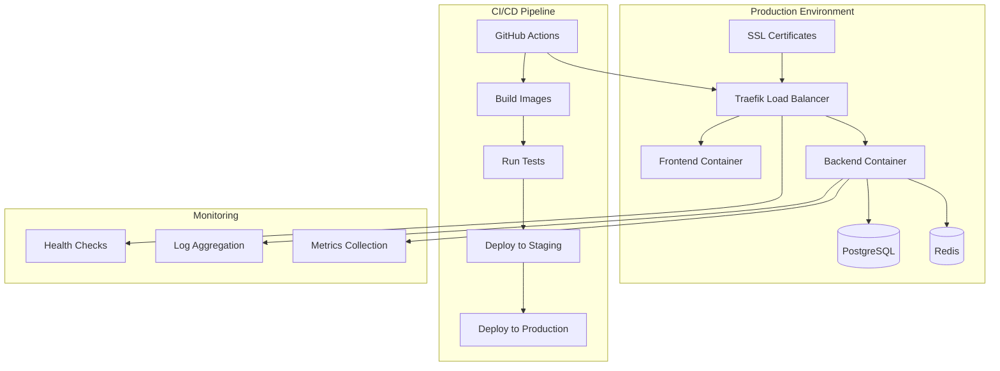
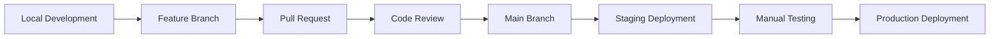

# Developer Onboarding Guide 🚀

Welcome to the FastAPI + React Full-Stack Template with Azure AD integration! This guide will help you get up to speed quickly with our modern web application stack.

## 📋 Table of Contents

1. [Quick Start](#-quick-start)
2. [Development Environment Setup](#-development-environment-setup)
3. [Project Architecture Overview](#-project-architecture-overview)
   - [MCP Integration Architecture](#mcp-integration-architecture)
4. [Role-Specific Guides](#-role-specific-guides)
5. [Development Workflow](#-development-workflow)
6. [Team Communication & Collaboration](#-team-communication--collaboration)
7. [Learning Resources](#-learning-resources)
8. [First Tasks & Milestones](#-first-tasks--milestones)
9. [Security & Compliance](#-security--compliance)
10. [Tools & Resources Access](#-tools--resources-access)
11. [Feedback & Continuous Improvement](#-feedback--continuous-improvement)
12. [Need Help?](#-need-help)

---

## 🚀 Quick Start

### Immediate Setup (5 minutes)
```bash
# 1. Clone and enter the project
git clone <repository-url>
cd fastapi-fastmcp-azureAD

# 2. Start the entire stack
docker compose watch

# 3. Access the application
# Frontend: http://localhost:5173
# Backend API: http://localhost:8000/docs
# MCP Weather Server: http://localhost:8001 (auto-started!)
# Database Admin: http://localhost:8080

# 4. Key API Endpoints
# Health Check: http://localhost:8000/api/v1/utils/health-check/
# MCP Server Health: http://localhost:8001/health
# Interactive Docs: http://localhost:8000/docs
# OpenAPI Schema: http://localhost:8000/openapi.json
```

### Your First 30 Minutes
- [ ] **Review this guide** - Read sections relevant to your role
- [ ] **Explore the running application** - Test login with `admin@example.com` / `changethis`
- [ ] **Browse the codebase** - Familiarize yourself with the project structure
- [ ] **Join communication channels** - Set up Slack/Discord/Teams access
- [ ] **Complete your profile** - Set up Git config, SSH keys, account access

---

## 🛠 Development Environment Setup

### System Requirements

**Operating System**
- Linux (Ubuntu 20+, Debian 11+)
- macOS 12+ (Intel/Apple Silicon)
- Windows 11 (with WSL2 for optimal experience)

**Required Software**
```bash
# Essential tools
- Git (2.30+)
- Docker (20.10+) & Docker Compose (2.0+)
- Node.js (via .nvmrc - currently v18+)
- Python 3.10-3.12
- uv (Python package manager)

# Recommended tools
- VS Code with extensions (see .vscode/extensions.json)
- Postman/Insomnia (API testing)
- DBeaver/DataGrip (database management)
```

### Installation Guide

#### 🐧 Linux (Ubuntu/Debian)
```bash
# System update
sudo apt update && sudo apt upgrade -y

# Essential packages
sudo apt install -y git curl wget build-essential

# Docker installation
curl -fsSL https://get.docker.com -o get-docker.sh
sh get-docker.sh
sudo usermod -aG docker $USER
newgrp docker

# Python & uv
curl -LsSf https://astral.sh/uv/install.sh | sh
source $HOME/.bashrc

# Node.js via fnm
curl -fsSL https://fnm.vercel.app/install | bash
source $HOME/.bashrc
fnm use  # Uses version from .nvmrc
```

#### 🍎 macOS
```bash
# Homebrew
/bin/bash -c "$(curl -fsSL https://raw.githubusercontent.com/Homebrew/install/HEAD/install.sh)"

# Essential tools
brew install git docker python@3.11

# uv for Python package management
curl -LsSf https://astral.sh/uv/install.sh | sh

# Node.js via fnm
brew install fnm
eval "$(fnm env --use-on-cd)"
fnm use
```

#### 🪟 Windows (WSL2)
```powershell
# In PowerShell (as Administrator)
wsl --install
wsl --set-default-version 2

# Restart, then in WSL2 terminal, follow Linux instructions above
# Install Docker Desktop for Windows with WSL2 backend
```

### Project Setup

```bash
# 1. Clone the repository
git clone <repository-url>
cd fastapi-fastmcp-azureAD

# 2. Environment configuration
cp .env.example .env
# Edit .env with your local configuration

# 3. Install pre-commit hooks
uv run pre-commit install

# 4. Build containers (optional - docker compose watch will do this)
docker compose build

# 5. Start development environment
docker compose watch

# 6. Verify installation
curl http://localhost:8000/api/v1/utils/health-check/  # Backend health check
curl http://localhost:5173  # Frontend access
```

### IDE Configuration

**VS Code Setup**
```bash
# Install recommended extensions
code --install-extension ms-python.python
code --install-extension ms-vscode.vscode-typescript-next
code --install-extension ms-vscode.vscode-json
code --install-extension bradlc.vscode-tailwindcss
code --install-extension ms-python.ruff

# Open project
code .
```

**Environment Validation Checklist**
- [ ] `docker --version` ≥ 20.10
- [ ] `docker compose version` ≥ 2.0
- [ ] `uv --version` (latest)
- [ ] `node --version` matches `.nvmrc`
- [ ] `python --version` is 3.10-3.12
- [ ] All URLs accessible: http://localhost:5173, http://localhost:8000/docs
- [ ] Pre-commit hooks installed: `pre-commit --version`

---

## 🏗 Project Architecture Overview

### Technology Stack

**Backend Stack**
```
FastAPI (Web Framework)
├── SQLModel (Database ORM)
├── PostgreSQL (Database)
├── Alembic (Migrations)
├── JWT + Passlib (Authentication)
├── Pydantic (Data Validation)
├── Azure AD + MSAL (SSO Integration)
├── FastMCP (Azure Integration) - **Auto-Start MCP Servers**
└── Redis (Caching/Sessions)
```

**Frontend Stack**
```
React 19 (UI Framework)
├── TypeScript (Type Safety)
├── Vite (Build Tool)
├── TanStack Router (Routing)
├── TanStack Query (State Management)
├── Chakra UI (Component Library)
├── React Hook Form (Form Management)
└── Axios (HTTP Client)
```

### MCP Integration Architecture

**Auto-Start MCP Servers**: All MCP servers automatically start with `docker compose watch` - no manual commands needed!

**Service Architecture**:
```
Port Layout:
├── 8000: Main FastAPI Backend
├── 8001: MCP Weather Server (AUTO-STARTED)
├── 8002: Reserved for future MCP servers
├── 5173: Frontend development server
├── 5432: PostgreSQL database
└── 6379: Redis cache/session store

Startup Dependencies:
PostgreSQL + Redis → Backend → MCP Servers → Frontend
```

**Key Features**:
- ✅ **Zero Manual Commands**: MCP servers start automatically
- 🔄 **Hot Reload**: Code changes restart MCP servers
- 🏗️ **Production Ready**: Health checks, restart policies, isolation
- 📈 **Scalable**: Easy to add multiple MCP servers

For detailed MCP integration patterns and options, see **[MCP Integration Guide](MCP_INTEGRATION_GUIDE.md)**.

**Infrastructure**
```
Docker Compose (Development)
├── Traefik (Reverse Proxy)
├── PostgreSQL (Database)
├── Redis (Cache)
├── Adminer (DB Admin)
└── MailCatcher (Email Testing)
```

### System Architecture Diagram



### Directory Structure Deep Dive

```
fastapi-fastmcp-azureAD/
├── 🔧 Configuration
│   ├── .env                     # Environment variables
│   ├── docker-compose.yml       # Production container config
│   ├── docker-compose.override.yml  # Development overrides
│   └── .pre-commit-config.yaml  # Code quality hooks
│
├── 🚀 Backend (/backend)
│   ├── app/
│   │   ├── main.py             # FastAPI application entry
│   │   ├── models.py           # SQLModel database models
│   │   ├── crud.py             # Database operations
│   │   ├── api/                # REST API endpoints
│   │   ├── core/               # Configuration & settings
│   │   └── tests/              # Backend test suite
│   ├── scripts/                # Utility scripts
│   ├── alembic/                # Database migrations
│   └── pyproject.toml          # Python dependencies
│
├── 🎨 Frontend (/frontend)
│   ├── src/
│   │   ├── components/         # React components
│   │   ├── routes/             # Page components
│   │   ├── hooks/              # Custom React hooks
│   │   ├── client/             # Generated API client
│   │   └── theme.tsx           # UI theme configuration
│   ├── tests/                  # Playwright E2E tests
│   └── package.json            # Node.js dependencies
│
├── 📊 Infrastructure
│   ├── scripts/                # Build & deployment scripts
│   ├── .github/                # CI/CD workflows
│   └── img/                    # Documentation assets
│
└── 📚 Documentation
    ├── README.md               # Project overview
    ├── DEVELOPER_ONBOARDING_GUIDE.md  # This guide
    ├── development.md          # Development instructions
    ├── deployment.md           # Deployment guide
    ├── SECURITY.md            # Security policy
    └── AGENTS.md              # AI assistant configuration
```

### Key Concepts

**Authentication Flow**
1. User accesses frontend → redirected to login
2. Frontend sends credentials → Backend validates
3. Backend issues JWT token → Frontend stores token
4. Subsequent API calls → Include JWT in Authorization header
5. Azure AD integration → SSO for enterprise users

**Data Flow**
1. Frontend components → API client (generated from OpenAPI)
2. API client → Backend FastAPI endpoints
3. FastAPI → SQLModel ORM → PostgreSQL database
4. Response path: Database → SQLModel → FastAPI → Frontend

**Development Workflow**
1. Code changes → Pre-commit hooks run (linting/formatting)
2. Push to branch → GitHub Actions CI/CD pipeline
3. Tests pass → Code review process
4. Merge approved → Automatic deployment to staging
5. Manual promotion → Production deployment

---

## 👥 Role-Specific Guides

### 🖥 Frontend Developer

**Your Focus Areas**
- React 19 with modern hooks and concurrent features
- TypeScript for type safety and better developer experience
- TanStack Router for file-based routing
- TanStack Query for server state management
- Chakra UI for consistent design system
- Playwright for end-to-end testing

**Key Files to Know**
```
frontend/
├── src/routes/            # Your main workspace - page components
├── src/components/        # Reusable UI components
├── src/hooks/            # Custom React hooks for logic
├── src/client/           # Auto-generated API client (don't edit)
├── src/theme.tsx         # Chakra UI theme customization
├── package.json          # Dependencies and scripts
├── tsconfig.json         # TypeScript configuration
├── vite.config.ts        # Build configuration
└── playwright.config.ts  # E2E testing setup
```

**Essential Commands**
```bash
# Development server with hot reload
cd frontend && npm run dev

# Build for production
npm run build

# Run linting and formatting
npm run lint

# Generate API client from backend OpenAPI spec
npm run generate-client

# Run end-to-end tests
npx playwright test

# Run specific test file
npx playwright test tests/auth.test.ts

# Interactive test debugging
npx playwright test --ui
```

**Daily Workflow**
1. **Start development**: `docker compose watch` or `cd frontend && npm run dev`
2. **Check API changes**: Run `npm run generate-client` if backend API updated
3. **Create components**: Follow existing patterns in `src/components/`
4. **Add routes**: Create new files in `src/routes/` (automatic routing)
5. **State management**: Use TanStack Query for server state, React state for local
6. **Testing**: Write E2E tests in `tests/` directory
7. **Quality checks**: `npm run lint` before committing

**Component Development Patterns**

*Creating a new page component:*
```typescript
// src/routes/users.tsx
import { createFileRoute } from '@tanstack/react-router'
import { Box, Heading } from '@chakra-ui/react'

export const Route = createFileRoute('/users')({
  component: UsersPage
})

function UsersPage() {
  return (
    <Box p={4}>
      <Heading>Users Management</Heading>
      {/* Your component logic */}
    </Box>
  )
}
```

*Using API client:*
```typescript
import { useQuery } from '@tanstack/react-query'
import { UsersService } from '@/client'

function UsersList() {
  const { data: users, isLoading } = useQuery({
    queryKey: ['users'],
    queryFn: () => UsersService.readUsers({})
  })

  if (isLoading) return <div>Loading...</div>

  return (
    <div>
      {users?.map(user => (
        <div key={user.id}>{user.email}</div>
      ))}
    </div>
  )
}
```

**Common Issues & Solutions**
- **API client outdated**: Run `npm run generate-client`
- **TypeScript errors**: Check if backend models changed
- **Build failures**: Ensure all imports are correct and files exist
- **Hot reload not working**: Restart `npm run dev`

---

### 🔧 Backend Developer

**Your Focus Areas**
- FastAPI for high-performance Python web APIs
- SQLModel for type-safe database operations
- PostgreSQL with Alembic migrations
- JWT authentication with Azure AD integration
- Pydantic for data validation and serialization
- Pytest for comprehensive testing

**Key Files to Know**
```
backend/
├── app/
│   ├── main.py              # FastAPI app and middleware setup
│   ├── models.py            # Database models (SQLModel)
│   ├── crud.py              # Database operations
│   ├── api/                 # API endpoint definitions
│   │   ├── deps.py          # Dependency injection
│   │   └── routes/          # Route modules
│   ├── core/
│   │   ├── config.py        # Application settings
│   │   ├── db.py            # Database connection
│   │   └── security.py      # Authentication utilities
│   └── tests/               # Backend test suite
├── scripts/                 # Utility scripts
├── alembic/                 # Database migrations
└── pyproject.toml           # Dependencies and tool config
```

**Essential Commands**
```bash
# Setup Python environment
cd backend && uv sync

# Activate virtual environment
source .venv/bin/activate

# Development server with hot reload
fastapi dev app/main.py

# Database operations
docker compose exec backend alembic revision --autogenerate -m "Add new table"
docker compose exec backend alembic upgrade head

# Testing
uv run bash scripts/tests-start.sh          # Run all tests
uv run pytest app/tests/test_users.py -v    # Specific test file
bash scripts/test.sh                        # Tests with coverage

# Code quality
uv run bash scripts/lint.sh                 # Linting and type checking
uv run bash scripts/format.sh               # Code formatting
```

**Daily Workflow**
1. **Start development**: `docker compose watch` or `fastapi dev app/main.py`
2. **Database changes**: Create migrations with Alembic
3. **API development**: Add endpoints in `app/api/routes/`
4. **Testing**: Write tests in `app/tests/`
5. **Documentation**: FastAPI generates OpenAPI docs automatically
6. **Quality checks**: Run `scripts/lint.sh` before committing

**API Development Patterns**

*Creating a new endpoint:*
```python
# app/api/routes/items.py
from fastapi import APIRouter, Depends
from sqlmodel import Session

from app.api.deps import CurrentUser, get_session
from app.models import Item, ItemCreate, ItemPublic

router = APIRouter()

@router.post("/", response_model=ItemPublic)
def create_item(
    *,
    session: Session = Depends(get_session),
    current_user: CurrentUser,
    item_in: ItemCreate
) -> Item:
    """Create new item."""
    item = Item.model_validate(
        item_in, update={"owner_id": current_user.id}
    )
    session.add(item)
    session.commit()
    session.refresh(item)
    return item
```

*Database model definition:*
```python
# app/models.py
from sqlmodel import SQLModel, Field

class ItemBase(SQLModel):
    title: str = Field(min_length=1, max_length=255)
    description: str | None = None

class Item(ItemBase, table=True):
    id: int | None = Field(default=None, primary_key=True)
    owner_id: int = Field(foreign_key="user.id")

class ItemCreate(ItemBase):
    pass

class ItemPublic(ItemBase):
    id: int
    owner_id: int
```

### Database Migrations with Alembic

**Migration System Overview**
- **Tool**: Alembic (SQLAlchemy's migration tool)
- **Source of Truth**: `app/models.py` defines database schema
- **Storage**: Migration files in `backend/alembic/versions/`
- **Control**: Manual migration application for safety

**Migration Workflow**

*1. Create Migration (after model changes):*
```bash
# Auto-generate migration from model changes
docker compose exec backend alembic revision --autogenerate -m "Add phone_number to users"

# Always review the generated migration file before applying!
```

*2. Review Generated Migration:*
```python
# Example: backend/alembic/versions/abc123_add_phone_number_to_users.py
def upgrade() -> None:
    op.add_column('user', sa.Column('phone_number', sa.String(), nullable=True))

def downgrade() -> None:
    op.drop_column('user', 'phone_number')
```

*3. Apply Migration:*
```bash
# Apply all pending migrations
docker compose exec backend alembic upgrade head

# Apply specific migration
docker compose exec backend alembic upgrade abc123
```

**Essential Migration Commands**
```bash
# Check current migration status
docker compose exec backend alembic current

# View migration history
docker compose exec backend alembic history --verbose

# Show pending migrations
docker compose exec backend alembic heads

# Downgrade to previous version
docker compose exec backend alembic downgrade -1

# Downgrade to specific revision
docker compose exec backend alembic downgrade abc123

# Show SQL that would be executed (dry run)
docker compose exec backend alembic upgrade head --sql
```

**Safety Practices**
- ✅ **Always review** auto-generated migrations before applying
- ✅ **Test migrations** on development database first
- ✅ **Backup production** database before applying migrations
- ✅ **Commit migration files** to version control
- ❌ **Never edit applied** migration files
- ❌ **Don't skip migration review** even for "simple" changes

**Migration Application Environments**

*Development:*
- Manual application using `alembic upgrade head`
- Safe to reset database with `docker compose down -v`
- Can easily test migration rollbacks

*Production:*
- Applied during deployment process before starting new containers
- Typically part of CI/CD pipeline
- Requires careful planning and backups

**Database Reset (Development Only)**
```bash
# Complete database reset - destroys all data!
docker compose down -v  # Stop and remove volumes
docker compose up -d db # Start fresh database
docker compose exec backend alembic upgrade head  # Apply all migrations
```

**Troubleshooting Migration Issues**

*Migration Conflicts:*
```bash
# When multiple developers create migrations simultaneously
docker compose exec backend alembic merge -m "Merge migrations"
# Review and edit the merge file, then apply
docker compose exec backend alembic upgrade head
```

*Failed Migration:*
```bash
# Check what failed
docker compose logs backend

# Manually fix database or rollback
docker compose exec backend alembic downgrade -1

# Fix the migration file and reapply
docker compose exec backend alembic upgrade head
```

*Out of Sync Models and Database:*
```bash
# Check current database state
docker compose exec backend alembic current

# Generate new migration to sync
docker compose exec backend alembic revision --autogenerate -m "Sync models with database"
```

**Common Issues & Solutions**
- **Migration conflicts**: Resolve with `alembic merge` or reset dev DB
- **Import errors**: Use absolute imports with `from app.`
- **Type errors**: Run `mypy` to check type annotations
- **Database connection issues**: Check Docker containers are running
- **Stuck migrations**: Check `alembic_version` table in database
- **Auto-generation missed changes**: Manually edit migration file

---

### 🏗 DevOps/Infrastructure

**Your Focus Areas**
- Docker containerization and orchestration
- GitHub Actions CI/CD pipelines
- Traefik reverse proxy configuration
- Environment management and secrets
- Monitoring and logging setup
- Security and compliance

**Key Files to Know**
```
├── docker-compose.yml           # Production container config
├── docker-compose.override.yml  # Development overrides
├── docker-compose.traefik.yml   # Traefik proxy setup
├── .github/workflows/           # CI/CD pipeline definitions
├── scripts/                     # Build and deployment scripts
├── backend/Dockerfile           # Backend container image
├── frontend/Dockerfile          # Frontend container image
└── .env                        # Environment configuration
```

**Essential Commands**
```bash
# Container management
docker compose up -d --build     # Build and start all services
docker compose watch            # Development with file watching
docker compose logs backend     # View service logs
docker compose exec backend bash # Access backend container

# Build and deployment
bash scripts/build.sh           # Build production images
bash scripts/generate-client.sh # Generate frontend API client

# Environment management
cp .env.example .env            # Setup environment variables
docker compose config          # Validate compose configuration
```

**CI/CD Pipeline Overview**

```yaml
# .github/workflows/test-backend.yml
name: Test Backend
on: [push, pull_request]

jobs:
  test:
    runs-on: ubuntu-latest
    services:
      postgres:
        image: postgres:15
        env:
          POSTGRES_PASSWORD: postgres
    steps:
      - uses: actions/checkout@v4
      - name: Set up Python
        uses: actions/setup-python@v4
        with:
          python-version: '3.11'
      - name: Install uv
        run: pip install uv
      - name: Install dependencies
        run: cd backend && uv sync
      - name: Run tests
        run: cd backend && uv run pytest
```

**Deployment Architecture**



**Environment Management**

*Development Environment:*
```bash
# .env for development
ENVIRONMENT=local
DOMAIN=localhost
SECRET_KEY=dev-secret-key
POSTGRES_PASSWORD=changethis
FIRST_SUPERUSER_PASSWORD=changethis
```

*Production Environment:*
```bash
# .env for production (use secure values)
ENVIRONMENT=production
DOMAIN=yourdomain.com
SECRET_KEY=your-secure-secret-key
POSTGRES_PASSWORD=secure-db-password
FIRST_SUPERUSER_PASSWORD=secure-admin-password
```

---

### 🧪 QA/Testing Engineer

**Your Focus Areas**
- Automated testing strategy and implementation
- End-to-end testing with Playwright
- API testing and validation
- Test data management and fixtures
- Performance and load testing
- Quality assurance processes

**Key Files to Know**
```
├── backend/app/tests/           # Backend unit/integration tests
├── frontend/tests/              # Frontend E2E tests
├── playwright.config.ts         # E2E testing configuration
├── backend/scripts/test.sh      # Backend testing scripts
└── .github/workflows/           # Automated testing pipelines
```

**Testing Strategy**

```mermaid
pyramid
    title Testing Pyramid
    base: "Unit Tests (Fast, Many)"
    middle: "Integration Tests (Medium, Some)"
    top: "E2E Tests (Slow, Few)"
```

**Essential Commands**
```bash
# Backend testing
cd backend
uv run pytest                           # All backend tests
uv run pytest app/tests/test_users.py   # Specific test module
uv run pytest --cov=app                 # With coverage report
uv run pytest -v -s                     # Verbose output

# Frontend E2E testing
cd frontend
npx playwright test                      # All E2E tests
npx playwright test auth.test.ts         # Specific test file
npx playwright test --ui                 # Interactive mode
npx playwright test --debug             # Debug mode

# Generate test reports
npx playwright show-report              # View test results
```

**Test Development Patterns**

*Backend API Test:*
```python
# backend/app/tests/test_items.py
import pytest
from fastapi.testclient import TestClient
from sqlmodel import Session

def test_create_item(
    client: TestClient,
    superuser_token_headers: dict[str, str]
) -> None:
    data = {"title": "Test Item", "description": "Test Description"}
    response = client.post(
        "/api/v1/items/",
        headers=superuser_token_headers,
        json=data,
    )
    assert response.status_code == 200
    content = response.json()
    assert content["title"] == data["title"]
    assert "id" in content
```

*Frontend E2E Test:*
```typescript
// frontend/tests/auth.test.ts
import { test, expect } from '@playwright/test'

test('user login flow', async ({ page }) => {
  // Navigate to login page
  await page.goto('/login')

  // Fill login form
  await page.fill('[data-testid="email-input"]', 'admin@example.com')
  await page.fill('[data-testid="password-input"]', 'changethis')

  // Submit form
  await page.click('[data-testid="login-button"]')

  // Verify successful login
  await expect(page.locator('text=Dashboard')).toBeVisible()
  await expect(page).toHaveURL('/dashboard')
})
```

**Test Data Management**

*Backend Test Fixtures:*
```python
# backend/app/tests/conftest.py
@pytest.fixture
def test_user_data():
    return {
        "email": "test@example.com",
        "password": "testpassword123",
        "full_name": "Test User"
    }

@pytest.fixture
def test_user(session: Session, test_user_data):
    user = create_user(session=session, user_create=UserCreate(**test_user_data))
    yield user
    # Cleanup happens automatically due to test database rollback
```

**Quality Gates & Thresholds**
- **Test Coverage**: Minimum 80% for backend, 70% for E2E scenarios
- **Performance**: API response times < 200ms for 95th percentile
- **Accessibility**: WCAG 2.1 AA compliance for all user-facing features
- **Security**: No high/critical vulnerabilities in dependencies
- **Browser Support**: Chrome, Firefox, Safari, Edge (latest 2 versions)

---

## 🔄 Development Workflow

### Git Workflow

We use a **Feature Branch Workflow** with the following conventions:

**Branch Naming**
```bash
feature/user-authentication      # New features
bugfix/login-validation-error   # Bug fixes
hotfix/security-patch          # Critical fixes
refactor/api-response-format   # Code improvements
docs/onboarding-guide         # Documentation updates
```

**Commit Message Format**
```bash
type(scope): description

feat(auth): add Azure AD integration
fix(api): resolve user creation validation error
docs(readme): update installation instructions
refactor(models): simplify user model structure
test(users): add comprehensive user CRUD tests
```

**Daily Git Workflow**
```bash
# 1. Start your day
git checkout main
git pull origin main

# 2. Create feature branch
git checkout -b feature/new-user-dashboard

# 3. Make your changes
# ... code, test, commit frequently ...

# 4. Pre-commit checks (automatic)
git add .
git commit -m "feat(dashboard): add user statistics widget"

# 5. Push your branch
git push origin feature/new-user-dashboard

# 6. Create Pull Request
# Use GitHub web interface

# 7. After PR approval
git checkout main
git pull origin main
git branch -d feature/new-user-dashboard
```

### Code Review Process

**Before Creating PR**
- [ ] All tests pass locally
- [ ] Code follows project style guidelines
- [ ] Documentation updated if needed
- [ ] Self-review completed
- [ ] Pre-commit hooks pass

**PR Requirements**
- [ ] Clear, descriptive title and description
- [ ] Link to relevant issue/ticket
- [ ] Screenshots for UI changes
- [ ] Test coverage maintained or improved
- [ ] No merge conflicts

**Review Checklist**
- **Functionality**: Does it work as intended?
- **Code Quality**: Is it readable and maintainable?
- **Performance**: Any performance implications?
- **Security**: No security vulnerabilities introduced?
- **Testing**: Adequate test coverage?
- **Documentation**: Clear comments and docs?

### Quality Gates

**Automated Checks (Pre-commit)**
```yaml
repos:
  - repo: https://github.com/astral-sh/ruff-pre-commit
    hooks:
      - id: ruff
        args: [--fix]
      - id: ruff-format
  - repo: https://github.com/biomejs/biome
    hooks:
      - id: biome-check
        args: [--write, --unsafe]
```

**CI/CD Pipeline Checks**
1. **Linting**: Code style and formatting
2. **Type Checking**: MyPy (backend), TypeScript (frontend)
3. **Unit Tests**: Backend pytest suite
4. **Integration Tests**: API endpoint testing
5. **E2E Tests**: Critical user journey validation
6. **Security Scan**: Dependency vulnerability check
7. **Build Verification**: Docker image building

### Environment Promotion



**Environment Configurations**
- **Development**: Local Docker Compose setup
- **Staging**: Production-like environment for testing
- **Production**: Live application with monitoring

---

## 🗣 Team Communication & Collaboration

### Communication Channels

**Primary Channels**
- **Slack/Discord**: Daily communication, quick questions
- **GitHub Issues**: Bug reports, feature requests, tasks
- **GitHub Discussions**: Architecture decisions, general discussions
- **Email**: Formal communications, security issues

**Channel Guidelines**
- **#general**: Team announcements, general discussion
- **#development**: Technical discussions, code-related questions
- **#alerts**: CI/CD notifications, system alerts
- **#random**: Non-work related, team building

### Meeting Structure

**Daily Standups (15 minutes)**
- What did you complete yesterday?
- What are you working on today?
- Any blockers or help needed?

**Weekly Planning (1 hour)**
- Sprint planning and task assignment
- Architecture discussions
- Code review priorities
- Technical debt planning

**Monthly Retrospectives**
- What went well?
- What could be improved?
- Action items for next iteration

### Documentation Standards

**Code Documentation**
```python
# Backend - Python docstring format
def create_user(
    *, session: Session, user_create: UserCreate
) -> User:
    """
    Create a new user in the database.

    Args:
        session: Database session
        user_create: User creation data

    Returns:
        User: Created user object

    Raises:
        ValueError: If email already exists
    """
```

```typescript
// Frontend - JSDoc format
/**
 * Custom hook for managing user authentication state
 * @returns Object containing auth state and methods
 */
export function useAuth() {
  // Implementation
}
```

**Technical Documentation**
- **ADR (Architecture Decision Records)**: Document important technical decisions
- **API Documentation**: Auto-generated from OpenAPI specs
- **Runbooks**: Step-by-step operational procedures
- **Troubleshooting Guides**: Common issues and solutions

### Issue Tracking

**Issue Labels**
- `bug`: Something isn't working
- `enhancement`: New feature or request
- `documentation`: Improvements or additions to documentation
- `good first issue`: Good for newcomers
- `help wanted`: Extra attention is needed
- `priority/high`: High priority
- `priority/critical`: Critical issue

**Issue Templates**
```markdown
## Bug Report

**Describe the bug**
A clear description of what the bug is.

**Steps to reproduce**
1. Go to '...'
2. Click on '....'
3. See error

**Expected behavior**
A clear description of what you expected to happen.

**Screenshots**
If applicable, add screenshots.

**Environment**
- OS: [e.g., macOS, Ubuntu]
- Browser: [e.g., Chrome, Firefox]
- Version: [e.g., 22]
```

---

## 📚 Learning Resources

### Essential Reading

**Framework Documentation**
- [FastAPI Documentation](https://fastapi.tiangolo.com/) - Comprehensive backend framework guide
- [React 19 Documentation](https://react.dev/) - Modern React patterns and features
- [SQLModel Documentation](https://sqlmodel.tiangolo.com/) - Type-safe database operations
- [TanStack Query](https://tanstack.com/query/) - Server state management
- [Chakra UI](https://chakra-ui.com/) - Component library and design system

**Advanced Topics**
- [Docker Best Practices](https://docs.docker.com/develop/best-practices/)
- [PostgreSQL Performance Tuning](https://www.postgresql.org/docs/current/performance-tips.html)
- [JWT Best Practices](https://auth0.com/blog/a-look-at-the-latest-draft-for-jwt-bcp/)
- [API Security](https://owasp.org/www-project-api-security/)
- [React Testing Patterns](https://kentcdodds.com/blog/common-mistakes-with-react-testing-library)

### Video Tutorials

**Getting Started**
- FastAPI Tutorial Series (YouTube)
- React 19 Features Overview
- Docker Compose for Development
- Modern Authentication Patterns

**Advanced Concepts**
- Database Design and Optimization
- API Design Best Practices
- Frontend Performance Optimization
- Security in Web Applications

### Hands-On Learning

**Interactive Tutorials**
- [FastAPI Tutorial](https://fastapi.tiangolo.com/tutorial/) - Official step-by-step guide
- [React Tutorial](https://react.dev/learn) - Official React learning path
- [SQL Teaching](https://sqlteaching.com/) - Interactive SQL lessons
- [Docker Play](https://labs.play-with-docker.com/) - Browser-based Docker environment

### Internal Resources

**Project-Specific Guides**
- [`development.md`](./development.md) - Local development setup
- [`deployment.md`](./deployment.md) - Production deployment guide
- [API Documentation](http://localhost:8000/docs) - Interactive API explorer
- [Architecture Decision Records](./docs/adr/) - Technical decisions history

---

## 🎯 First Tasks & Milestones

### Week 1: Foundation (Getting Started)

**Day 1-2: Environment Setup**
- [ ] Complete development environment setup
- [ ] Run application successfully locally
- [ ] Explore all application features as a user
- [ ] Review codebase structure and key files

**Day 3-4: Code Exploration**
- [ ] Read through key components and understand patterns
- [ ] Set up IDE with recommended extensions
- [ ] Configure Git with pre-commit hooks
- [ ] Join team communication channels

**Day 5: First Contribution**
- [ ] Fix a "good first issue" from GitHub issues
- [ ] Create your first pull request
- [ ] Complete code review process
- [ ] Deploy and test your change

### Week 2-3: Skill Building

**Choose Your Track:**

**Frontend Track:**
- [ ] Create a new React component using Chakra UI
- [ ] Implement form handling with React Hook Form
- [ ] Add client-side routing with TanStack Router
- [ ] Write E2E tests for your component

**Backend Track:**
- [ ] Create a new API endpoint with proper validation
- [ ] Add database model and migration
- [ ] Implement CRUD operations with tests
- [ ] Add authentication to your endpoint

**Full-Stack Track:**
- [ ] Design and implement a small feature end-to-end
- [ ] Create both frontend and backend components
- [ ] Write comprehensive tests
- [ ] Update API documentation

### Month 1: Integration

**Milestone: Complete Feature Delivery**
- [ ] **Planning**: Work with team to scope a feature
- [ ] **Design**: Create technical design document
- [ ] **Implementation**: Build feature with tests
- [ ] **Review**: Complete thorough code review
- [ ] **Deployment**: Deploy to staging and production
- [ ] **Monitoring**: Monitor feature performance and usage

### Learning Checkpoints

**Technical Skills Assessment**
- [ ] Can set up development environment independently
- [ ] Understands project architecture and data flow
- [ ] Can write tests for new code
- [ ] Follows code review and git workflows
- [ ] Can debug issues using appropriate tools

**Team Integration Assessment**
- [ ] Participates actively in team meetings
- [ ] Asks questions and seeks help when needed
- [ ] Helps other team members when possible
- [ ] Contributes to team discussions and decisions

---

## 🔐 Security & Compliance

### Security Principles

**Authentication & Authorization**
- JWT tokens with secure key rotation
- Azure AD integration for enterprise SSO
- Role-based access control (RBAC)
- Session management with secure cookies

**Data Protection**
- Encryption at rest and in transit
- PII handling and anonymization
- GDPR compliance for EU users
- Regular security audits and penetration testing

**Code Security**
- Dependency vulnerability scanning
- Secure coding practices
- Input validation and sanitization
- SQL injection prevention

### Compliance Requirements

**Code Security Checklist**
- [ ] No secrets in code or configuration files
- [ ] All external inputs validated
- [ ] Authentication required for protected endpoints
- [ ] Proper error handling (no sensitive data in errors)
- [ ] Dependencies regularly updated

**Data Handling Guidelines**
- [ ] Encrypt sensitive data in database
- [ ] Log access to sensitive operations
- [ ] Implement data retention policies
- [ ] Regular backup and disaster recovery testing

### Security Tools

**Automated Security Scanning**
```bash
# Dependency scanning
uv run safety check                    # Python dependencies
npm audit                             # Node.js dependencies

# Code security analysis
bandit -r backend/app/                # Python security linter
npm run security-audit               # Frontend security check

# Container security
docker scout cves                    # Container vulnerability scan
```

**Security Headers**
```python
# backend/app/main.py
from fastapi.middleware.security import SecurityMiddleware

app.add_middleware(
    SecurityMiddleware,
    enforce_https=True,
    server="",  # Hide server information
    hsts_max_age=31536000,
    hsts_include_subdomains=True,
)
```

### Incident Response

**Security Incident Process**
1. **Detection**: Automated alerts or manual discovery
2. **Assessment**: Determine severity and impact
3. **Containment**: Isolate affected systems
4. **Investigation**: Root cause analysis
5. **Recovery**: Restore normal operations
6. **Review**: Post-incident review and improvements

**Emergency Contacts**
- Security Team: security@company.com
- On-Call Engineer: [Internal contact system]
- Infrastructure Team: infrastructure@company.com

---

## 🛠 Tools & Resources Access

### Development Tools

**Required Accounts**
- [ ] **GitHub**: Repository access and issue tracking
- [ ] **Docker Hub**: Container image registry (if needed)
- [ ] **Azure Portal**: Azure AD configuration and monitoring
- [ ] **Sentry**: Error tracking and monitoring
- [ ] **Team Communication**: Slack/Discord/Teams access

**Recommended Tools**
```bash
# Code editors
- VS Code (recommended with extensions)
- PyCharm/WebStorm (JetBrains IDEs)
- Vim/Neovim (for terminal enthusiasts)

# API testing
- Postman or Insomnia
- httpie (command-line HTTP client)
- curl (built-in testing)

# Database management
- DBeaver (free, cross-platform)
- pgAdmin (PostgreSQL-specific)
- DataGrip (JetBrains, paid)

# Container management
- Docker Desktop
- Portainer (web-based Docker UI)
- Kubernetes tools (if using K8s)
```

### Access Requests

**Internal Tools Access**
1. **GitHub Organization**: Request from team lead
2. **Azure AD Admin**: Request from IT/Security team
3. **Production Environments**: Requires manager approval
4. **Monitoring Tools**: Standard access for all developers

**VPN and Network Access**
```bash
# VPN setup (if required)
# Contact IT team for:
- VPN client configuration
- Network access credentials
- Firewall exceptions for development
```

### Troubleshooting Common Issues

**Environment Setup Problems**

*Docker issues:*
```bash
# Permission denied
sudo usermod -aG docker $USER
newgrp docker

# Port already in use
docker compose down
lsof -ti:5173 | xargs kill  # Kill process on port 5173

# Container build failures
docker system prune        # Clean up old images
docker compose build --no-cache
```

*Python/uv issues:*
```bash
# Installation problems
curl -LsSf https://astral.sh/uv/install.sh | sh
source ~/.bashrc

# Virtual environment issues
uv venv --python 3.11
source .venv/bin/activate
```

*Node.js/npm issues:*
```bash
# Version management
fnm install 18
fnm use 18
npm cache clean --force
rm -rf node_modules package-lock.json
npm install
```

**Development Issues**

*Database connection:*
```bash
# Check if PostgreSQL is running
docker compose ps
docker compose logs db

# Reset database
docker compose down -v
docker compose up -d db
```

*API client sync issues:*
```bash
# Regenerate API client
cd frontend
npm run generate-client

# Check backend API docs
curl http://localhost:8000/openapi.json
```

### Getting Help

**Escalation Path**
1. **Self-service**: Check documentation and troubleshooting guides
2. **Team Chat**: Ask questions in development channels
3. **Pair Programming**: Schedule time with experienced team member
4. **Tech Lead**: For architectural or complex technical questions
5. **Manager**: For access, process, or priority questions

**Support Contacts**
- **Technical Issues**: `#development` channel
- **Access Problems**: IT team or manager
- **Security Concerns**: security@company.com
- **Emergency Issues**: On-call rotation

---

## 🔄 Feedback & Continuous Improvement

### Feedback Mechanisms

**Regular Check-ins**
- **Week 1**: Daily check-ins with mentor/buddy
- **Week 2-4**: Bi-weekly progress reviews
- **Month 1+**: Monthly one-on-one meetings
- **Quarterly**: Comprehensive performance reviews

**Feedback Channels**
- **Direct Feedback**: Mentor/manager conversations
- **Peer Feedback**: Code reviews and pair programming
- **Anonymous Feedback**: Internal surveys and suggestion box
- **Team Retrospectives**: Process improvement discussions

### Onboarding Feedback Form

**Your Experience (Please complete after Week 1)**

**Environment Setup** (1-5 scale)
- How easy was it to set up your development environment?
- Were the instructions clear and complete?
- What tools or steps caused the most difficulty?

**Documentation Quality** (1-5 scale)
- How helpful was this onboarding guide?
- What sections need more detail or clarification?
- What additional information would have been useful?

**Team Integration** (1-5 scale)
- How welcoming and helpful was the team?
- Did you feel comfortable asking questions?
- How effective were the communication channels?

**Open Feedback**
- What was the most valuable part of your onboarding?
- What was the most challenging aspect?
- What would you change about the onboarding process?
- Any additional resources or support you would have liked?

### Success Metrics

**Onboarding Success Indicators**
- **Time to First Commit**: Target < 3 days
- **Time to First Feature**: Target < 2 weeks
- **Environment Setup**: Target < 4 hours
- **Knowledge Assessment**: 80%+ understanding of key concepts
- **Team Integration**: Positive feedback from team members

**Long-term Success Metrics**
- **Code Quality**: PRs meet team standards consistently
- **Productivity**: Feature delivery velocity matches team average
- **Knowledge Sharing**: Contributes to documentation and helps other team members
- **Professional Growth**: Takes on increasing responsibilities and complex tasks

### Continuous Improvement Process

**Monthly Onboarding Review**
- Analyze feedback from new team members
- Update documentation based on common questions
- Refine environment setup process
- Update learning resources and links

**Quarterly Process Enhancement**
- Review onboarding metrics and success rates
- Survey team members on mentoring effectiveness
- Update technical content for new tools/frameworks
- Benchmark against industry best practices

---

## 📞 Need Help?

### Quick Reference

**Emergency Contacts**
- **Production Issues**: On-call engineer via [contact method]
- **Security Incidents**: security@company.com
- **IT Support**: it-support@company.com

**Daily Support**
- **Technical Questions**: `#development` channel
- **Process Questions**: Your mentor or team lead
- **Access Issues**: IT team or manager

**Useful Commands**
```bash
# Quick health check - Main app
curl http://localhost:8000/api/v1/utils/health-check/

# Quick health check - MCP Weather Server (auto-started)
curl http://localhost:8001/health

# Restart everything
docker compose down && docker compose watch

# Check logs
docker compose logs --tail=50 --follow

# Run tests
cd backend && uv run pytest
cd frontend && npx playwright test
```

---

**Welcome to the team! 🎉**

This guide is a living document - please contribute improvements and ask questions. Your fresh perspective as a new team member is valuable for making our onboarding process better for everyone who comes after you.

*Happy coding!* 💻
