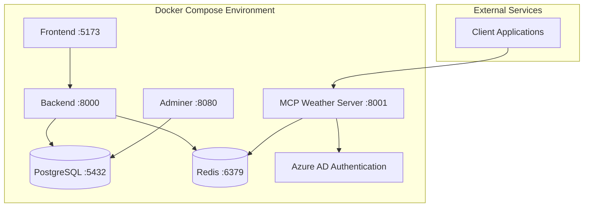

# MCP Server Integration Guide 🤖

**FastAPI + Azure AD + FastMCP Integration Options**

This guide documents the analysis and implementation options for automatically starting MCP servers within the FastAPI application ecosystem, eliminating the need for manual server management.

## 📋 Table of Contents

1. [Overview](#-overview)
2. [Integration Options](#-integration-options)
3. [Recommended Implementation](#-recommended-implementation)
4. [Architecture Analysis](#-architecture-analysis)
5. [Implementation Examples](#-implementation-examples)
6. [Testing & Validation](#-testing--validation)
7. [Future Scalability](#-future-scalability)

---

## 🎯 Overview

### Current Challenge
Previously, MCP servers required manual startup:
```bash
docker compose exec backend uvicorn app.mcp.weather_server:app --host 0.0.0.0 --port 8001 --reload
```

### Solution Goal
Automatically start MCP servers when the main application starts, providing:
- ✅ **Zero Manual Commands**: MCP servers start with `docker compose watch`
- ✅ **Development Parity**: Same behavior in dev and production
- ✅ **Hot Reload**: Code changes automatically restart MCP servers
- ✅ **Scalable Architecture**: Easy to add multiple MCP servers
- ✅ **Proper Dependencies**: MCP servers wait for required services

---

## 🚀 Integration Options

### Option 1: Embedded Integration
**Best for**: Single MCP server that's core to your application

**Approach**: Mount MCP FastAPI app within main FastAPI app
```python
# Mount MCP routes under /mcp prefix
app.mount("/mcp-server", mcp_app)
```

**Pros**:
- ✅ Single process, shared resources
- ✅ Simple deployment
- ✅ Shared middleware and configuration

**Cons**:
- ❌ Resource contention between main app and MCP
- ❌ Difficult to scale multiple MCP servers
- ❌ Single point of failure

**Files Created**: `backend/app/main_with_mcp.py`

---

### Option 2: Docker Compose Services ⭐ **RECOMMENDED**
**Best for**: Production-ready scalable architecture with multiple MCP servers

**Approach**: Dedicated Docker Compose service for each MCP server
```yaml
mcp-weather:
  image: "${DOCKER_IMAGE_BACKEND}:${TAG-latest}"
  command: uvicorn app.mcp.weather_server:app --host 0.0.0.0 --port 8000 --reload
  ports:
    - "8001:8000"
```

**Pros**:
- ✅ **Isolated resources** for each MCP server
- ✅ **Independent scaling** and health monitoring
- ✅ **Production-ready** with health checks and restart policies
- ✅ **Easy to add** new MCP servers
- ✅ **Matches existing** Docker infrastructure

**Cons**:
- ⚠️ Slightly more complex configuration
- ⚠️ More resource usage (separate containers)

**Files Created**:
- `docker-compose.mcp.yml` (production template)
- `docker-compose.override.yml` (updated for development)

---

### Option 3: Background Process Manager
**Best for**: Complex process orchestration with runtime management

**Approach**: Python subprocess management with health monitoring
```python
# Start MCP servers as background processes
await mcp_manager.start_all_servers()
```

**Pros**:
- ✅ **Runtime control** - start/stop servers via API
- ✅ **Health monitoring** and automatic restart
- ✅ **Resource monitoring** (CPU, memory usage)
- ✅ **Advanced process management** features

**Cons**:
- ❌ **High complexity** - subprocess management is tricky
- ⚠️ **Platform dependencies** (Unix signals, etc.)
- ⚠️ **Debugging challenges** with multiple processes

**Files Created**:
- `backend/app/mcp/manager.py`
- `backend/app/main_with_manager.py`

---

### Option 4: Startup Script Integration
**Best for**: Simple integration with existing startup process

**Approach**: Shell script that manages MCP server lifecycle
```bash
start_mcp_server "weather" "app.mcp.weather_server:app" "8001"
```

**Pros**:
- ✅ **Simple implementation** using familiar shell scripting
- ✅ **Health checking** and automatic restart capabilities
- ✅ **Graceful shutdown** handling
- ✅ **Easy to understand** and modify

**Cons**:
- ⚠️ **Platform specific** (bash/shell dependent)
- ⚠️ **Less robust** than container orchestration
- ❌ **Not production-ready** without additional tooling

**Files Created**: `backend/scripts/start-mcp-servers.sh`

---

## ⭐ Recommended Implementation

### Selected: **Option 2 (Docker Compose Services)**

**Why This Option?**
1. **Infrastructure Alignment**: Matches existing Docker-first architecture
2. **Production Ready**: Built-in health checks, restart policies, resource isolation
3. **Developer Experience**: Auto-starts with `docker compose watch`
4. **Scalability**: Easy to add multiple MCP servers
5. **Debugging**: Isolated containers with separate logs

### Implementation Applied

**Development Configuration** (`docker-compose.override.yml`):
```yaml
mcp-weather:
  build:
    context: ./backend
  ports:
    - "8001:8000"
  depends_on:
    - backend
    - redis
  command: uvicorn app.mcp.weather_server:app --host 0.0.0.0 --port 8000 --reload
  develop:
    watch:
      - path: ./backend
        action: sync
```

**Usage**:
```bash
# Start everything including MCP server
docker compose watch

# Access services
curl http://localhost:8000/api/v1/utils/health-check/  # Main app
curl http://localhost:8001/health                       # MCP server (auto-started!)
```

---

## 🏗 Architecture Analysis

### Service Topology


### Resource Dependencies
```yaml
Startup Order:
  1. PostgreSQL + Redis (foundational data services)
  2. Backend (main FastAPI application)
  3. MCP Weather Server (depends on Redis + Azure AD config)
  4. Frontend (depends on backend availability)

Health Check Chain:
  Backend → PostgreSQL ✅
  MCP Server → Redis ✅ + Azure AD configuration ✅
  System → All services healthy ✅
```

### Port Allocation
- **8000**: Main FastAPI backend
- **8001**: MCP Weather Server
- **8002**: Reserved for future MCP servers
- **8010**: Reserved for MCP Registry/Gateway
- **5173**: Frontend development server
- **5432**: PostgreSQL database
- **6379**: Redis cache/session store

---

## 🛠 Implementation Examples

### Adding New MCP Server

**Step 1**: Create MCP server module
```python
# backend/app/mcp/finance_server.py
class FinanceMCPServer:
    def __init__(self):
        self.app = FastAPI(title="Finance MCP Server", version="1.0.0")
        self.setup_mcp_server()
        # ... implementation
```

**Step 2**: Add to Docker Compose
```yaml
# docker-compose.override.yml
mcp-finance:
  build:
    context: ./backend
  ports:
    - "8002:8000"
  command: uvicorn app.mcp.finance_server:app --host 0.0.0.0 --port 8000 --reload
  depends_on:
    - backend
    - redis
```

**Step 3**: Update environment configuration
```bash
# .env
AZURE_REDIRECT_URI_FINANCE=http://localhost:8002/auth/callback
```

### MCP Registry Pattern (Future)

For multiple MCP servers, implement a registry:
```python
# backend/app/mcp/registry.py
class MCPRegistry:
    def __init__(self):
        self.servers = {
            "weather": "http://mcp-weather:8000",
            "finance": "http://mcp-finance:8000"
        }

    def route_request(self, server_name: str, request):
        # Route MCP requests to appropriate server
        pass
```

---

## 🧪 Testing & Validation

### Updated Testing Workflow

**Development Testing**:
```bash
# 1. Start everything (now includes MCP!)
docker compose watch

# 2. Run development tests
cd backend
./scripts/test_mcp_server.py

# 3. Run production tests with Azure AD
./scripts/test_mcp_production.py
```

**Production Testing**:
```bash
# 1. Deploy with MCP services
docker compose -f docker-compose.yml -f docker-compose.mcp.yml up -d

# 2. Validate health
curl https://mcp-weather.yourdomain.com/health

# 3. Test authentication flow
# (Use production test script)
```

### Health Check Endpoints

**Main Application**:
- `GET /api/v1/utils/health-check/` → Main app health
- `GET /api/v1/mcp/health` → MCP integration status (if using embedded option)

**MCP Weather Server**:
- `GET /health` → MCP server health + Redis + Azure AD status
- `GET /` → Server information and endpoint documentation
- `GET /docs` → Interactive API documentation

### Test Coverage Matrix

| Test Type | Manual Command | Auto-Start Docker | Status |
|-----------|----------------|-------------------|---------|
| **Server Startup** | ⚠️ Manual | ✅ Automatic | Improved |
| **Health Checks** | ✅ Works | ✅ Works | Maintained |
| **Azure AD Auth** | ✅ Works | ✅ Works | Maintained |
| **MCP Protocol** | ✅ Works | ✅ Works | Maintained |
| **Hot Reload** | ❌ Manual restart | ✅ Automatic | Improved |
| **Multi-Server** | ❌ Complex | ✅ Simple | New Feature |

---

## 🔮 Future Scalability

### Multi-MCP Architecture

**MCP Gateway Pattern**:
```yaml
# Future architecture
mcp-gateway:     # Routes requests to appropriate MCP servers
  ports: ["8010:8000"]

mcp-weather:     # Weather-specific tools
  ports: ["8001:8000"]

mcp-finance:     # Finance-specific tools
  ports: ["8002:8000"]

mcp-analytics:   # Analytics and reporting tools
  ports: ["8003:8000"]
```

**Load Balancing**:
```yaml
# Production scaling
mcp-weather:
  deploy:
    replicas: 3
  environment:
    - REDIS_CLUSTER=weather-cluster
```

### Configuration Management

**Environment-Based MCP Selection**:
```yaml
# .env.development
ENABLED_MCP_SERVERS=weather,finance

# .env.production
ENABLED_MCP_SERVERS=weather,finance,analytics,compliance
```

**Dynamic Server Discovery**:
```python
# Future: Service discovery pattern
class MCPServiceRegistry:
    def discover_servers(self) -> List[MCPServerInfo]:
        # Auto-discover running MCP servers
        # Register with service mesh
        # Health monitoring integration
        pass
```

### Monitoring & Observability

**Future Enhancements**:
- **Distributed Tracing**: OpenTelemetry integration across MCP servers
- **Centralized Logging**: Aggregate logs from all MCP servers
- **Metrics Dashboard**: Grafana dashboard for MCP server performance
- **Alert Management**: PagerDuty integration for MCP server failures

---

## 📚 Related Documentation

### Internal References
- **[Developer Onboarding Guide](DEVELOPER_ONBOARDING_GUIDE.md)** - Setup instructions
- **[FastMCP Integration Complete](FASTMCP_AZURE_INTEGRATION_COMPLETE.md)** - Implementation details
- **[Development Setup](development.md)** - Local development procedures
- **[Security Policy](SECURITY.md)** - Security guidelines for MCP servers

### External Resources
- **[FastMCP Documentation](https://github.com/jlowin/fastmcp)** - Official FastMCP library
- **[Azure AD Integration](https://docs.microsoft.com/azure/active-directory/)** - Authentication setup
- **[Docker Compose](https://docs.docker.com/compose/)** - Container orchestration
- **[FastAPI Documentation](https://fastapi.tiangolo.com/)** - Web framework docs

---

## ✅ Implementation Checklist

### Completed ✅
- [x] **Option Analysis**: Evaluated 4 integration approaches
- [x] **Docker Compose Integration**: Added MCP service to development environment
- [x] **Auto-Start Configuration**: MCP server starts with `docker compose watch`
- [x] **Testing Scripts**: Updated test scripts for new architecture
- [x] **Documentation**: Comprehensive integration guide created
- [x] **Port Management**: Allocated ports for current and future MCP servers

### Future Enhancements 🔮
- [ ] **Production Deployment**: Full production Docker Compose configuration
- [ ] **MCP Registry**: Central registry for multiple MCP servers
- [ ] **Service Discovery**: Dynamic MCP server detection
- [ ] **Monitoring Integration**: Health checks and performance monitoring
- [ ] **Load Balancing**: Scale MCP servers based on demand
- [ ] **Security Hardening**: Enhanced authentication and authorization

---

**Status**: ✅ **IMPLEMENTED** - MCP Weather Server now auto-starts with Docker Compose
**Next Steps**: Deploy to staging environment and test production configuration

*Last Updated: 2025-01-09*
*Author: Claude Code Analysis*
