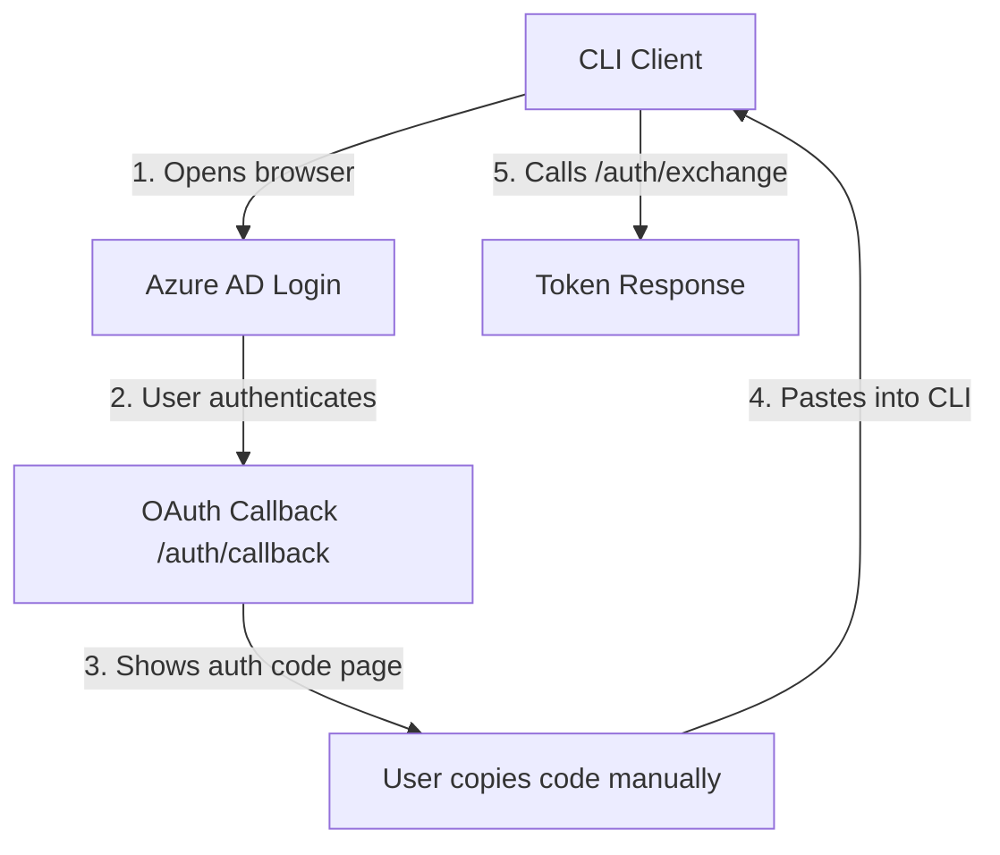
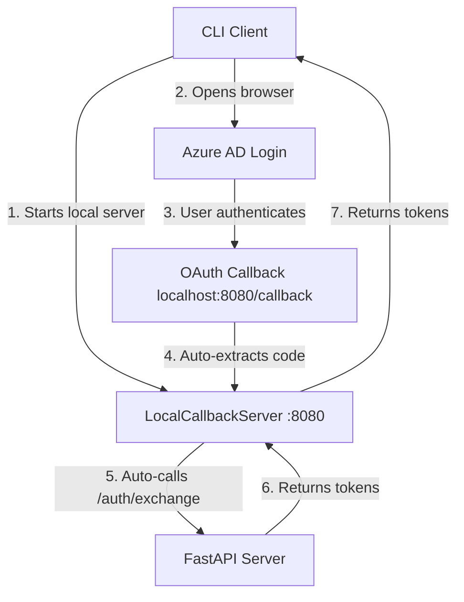

# Azure AD Authentication UX Enhancement Options

**Project**: FastAPI + FastMCP + Azure AD Integration
**Issue**: Manual copy/paste requirement for OAuth authentication code
**Date**: 2025-01-09
**Status**: Phase 1 Implementation Ready

## Current Problem

The Azure AD authentication flow presents users with:
```
Login successful. Use this code to exchange for token: <auth_code>
```

Users must manually copy this code and paste it into the CLI application, creating friction in the authentication process.

## Current Architecture



## Enhancement Options

### 🥇 Option 1: Local Callback Server (Recommended)
**Complexity**: Medium | **UX Impact**: Excellent | **Industry Standard**

#### Description
Replace manual copy/paste with automated local HTTP server that captures OAuth callback directly.

#### Implementation Details
```python
class LocalCallbackServer:
    def __init__(self, base_url: str):
        self.base_url = base_url
        self.port = self._find_available_port(8000, 8999)
        self.auth_code = None
        self.token_data = None

    def start_and_wait(self) -> dict:
        # Start temporary HTTP server
        # Handle /callback automatically
        # Exchange auth code for token
        # Return token data and shutdown
```

#### Architecture Changes


#### Benefits
- ✅ **Zero manual steps** after authentication
- ✅ **Industry standard** (used by Google Cloud CLI, AWS CLI, GitHub CLI)
- ✅ **Secure** - localhost-only communication
- ✅ **Professional UX** - matches modern CLI tools
- ✅ **Error handling** - graceful timeout and error management

#### Implementation Requirements
1. **Test Script Changes**: Add `LocalCallbackServer` class
2. **Azure AD Config**: Update redirect URI to `http://localhost:{port}/callback`
3. **Port Management**: Dynamic port selection with conflict resolution
4. **Error Handling**: Timeout, port conflicts, exchange failures

---

### 🥈 Option 2: JavaScript Auto-Exchange
**Complexity**: Low | **UX Impact**: Good

#### Description
Enhance callback HTML with JavaScript that automatically exchanges the auth code, eliminating copy/paste.

#### Implementation Details
```html
<!DOCTYPE html>
<html>
<head>
    <title>Authentication Success</title>
    <style>
        body { font-family: Arial, sans-serif; text-align: center; padding: 50px; }
        .success { color: #28a745; }
        .loading { color: #007bff; }
        .error { color: #dc3545; }
    </style>
</head>
<body>
    <div id="status" class="loading">
        <h2>🔄 Processing authentication...</h2>
        <p>Please wait while we complete your login.</p>
    </div>

    <script>
        fetch('/auth/exchange', {
            method: 'POST',
            headers: { 'Content-Type': 'application/json' },
            body: JSON.stringify({ auth_code: '{auth_code}' })
        })
        .then(response => response.json())
        .then(data => {
            if (data.access_token) {
                document.getElementById('status').innerHTML = `
                    <div class="success">
                        <h2>✅ Authentication Complete!</h2>
                        <p>You can now close this browser window.</p>
                        <p><small>Return to your application to continue.</small></p>
                    </div>
                `;
            } else {
                throw new Error(data.error || 'Authentication failed');
            }
        })
        .catch(error => {
            document.getElementById('status').innerHTML = `
                <div class="error">
                    <h2>❌ Authentication Failed</h2>
                    <p>Error: ${error.message}</p>
                    <p>Please try authenticating again.</p>
                </div>
            `;
        });
    </script>
</body>
</html>
```

#### Benefits
- ✅ **No client changes** needed
- ✅ **Quick implementation** (~50 lines of code)
- ✅ **Immediate feedback** to users
- ⚠️ **Manual browser closure** still required

#### Implementation Requirements
1. **Callback Response**: Replace simple text with HTML template
2. **Error Handling**: Display exchange failures gracefully
3. **Visual Design**: Professional loading/success states

---

### 🥉 Option 3: Enhanced UI (Quick Win)
**Complexity**: Very Low | **UX Impact**: Basic

#### Description
Improve callback page UI with better styling and copy-to-clipboard functionality without changing core flow.

#### Implementation Details
```html
<!DOCTYPE html>
<html>
<head>
    <title>Authentication Code</title>
    <style>
        body {
            font-family: -apple-system, BlinkMacSystemFont, 'Segoe UI', Roboto, sans-serif;
            max-width: 600px; margin: 50px auto; padding: 20px; text-align: center;
        }
        .code-container {
            background: #f8f9fa; border: 2px solid #dee2e6; border-radius: 8px;
            padding: 20px; margin: 20px 0;
        }
        .auth-code {
            font-family: 'Monaco', 'Menlo', monospace; font-size: 18px;
            font-weight: bold; color: #495057; letter-spacing: 2px;
        }
        .copy-btn {
            background: #007bff; color: white; border: none; border-radius: 6px;
            padding: 12px 24px; font-size: 16px; cursor: pointer; margin-top: 15px;
        }
        .copy-btn:hover { background: #0056b3; }
        .copy-btn:active { transform: translateY(1px); }
        .copied { background: #28a745 !important; }
        .instructions { color: #6c757d; margin-top: 20px; font-size: 14px; }
    </style>
</head>
<body>
    <h2>🎉 Authentication Successful!</h2>
    <p>Copy this code to complete your authentication:</p>

    <div class="code-container">
        <div class="auth-code" id="auth-code">{auth_code}</div>
        <button class="copy-btn" id="copy-btn" onclick="copyToClipboard()">
            📋 Copy to Clipboard
        </button>
    </div>

    <div class="instructions">
        <p>1. Click the button above to copy the authentication code</p>
        <p>2. Return to your application and paste the code when prompted</p>
        <p>3. You can close this browser window after copying</p>
    </div>

    <script>
        function copyToClipboard() {
            const code = document.getElementById('auth-code').textContent;
            const btn = document.getElementById('copy-btn');

            navigator.clipboard.writeText(code).then(() => {
                btn.textContent = '✅ Copied!';
                btn.classList.add('copied');

                setTimeout(() => {
                    btn.textContent = '📋 Copy to Clipboard';
                    btn.classList.remove('copied');
                }, 2000);
            }).catch(() => {
                // Fallback for older browsers
                const textArea = document.createElement('textarea');
                textArea.value = code;
                document.body.appendChild(textArea);
                textArea.select();
                document.execCommand('copy');
                document.body.removeChild(textArea);

                btn.textContent = '✅ Copied!';
                btn.classList.add('copied');
                setTimeout(() => {
                    btn.textContent = '📋 Copy to Clipboard';
                    btn.classList.remove('copied');
                }, 2000);
            });
        }

        // Auto-select code on click for manual selection
        document.getElementById('auth-code').onclick = function() {
            const range = document.createRange();
            range.selectNode(this);
            window.getSelection().removeAllRanges();
            window.getSelection().addRange(range);
        };
    </script>
</body>
</html>
```

#### Benefits
- ✅ **Immediate improvement** with minimal development effort
- ✅ **Professional appearance** with modern UI design
- ✅ **Copy-to-clipboard** functionality with visual feedback
- ✅ **Mobile-friendly** responsive design
- ✅ **Backward compatible** - works with existing flow

---

## Implementation Plan

### Phase 1: Enhanced UI (Immediate Implementation)
**Timeline**: 1-2 hours
**Risk**: Very Low
**User Impact**: Moderate improvement

#### Tasks
1. ✅ Create HTML template for enhanced callback UI
2. ✅ Implement copy-to-clipboard functionality with fallbacks
3. ✅ Add responsive design and professional styling
4. ✅ Update callback endpoint in `azure_auth.py`
5. ✅ Test functionality across browsers

### Phase 2: Local Callback Server (Future Enhancement)
**Timeline**: 1-2 days
**Risk**: Low-Medium
**User Impact**: Excellent - industry-standard UX

#### Tasks
- [ ] Implement `LocalCallbackServer` class in test script
- [ ] Add dynamic port selection and conflict resolution
- [ ] Update Azure AD redirect URI configuration
- [ ] Implement automatic token exchange and error handling
- [ ] Add comprehensive testing for various failure scenarios

### Phase 3: JavaScript Auto-Exchange (Alternative)
**Timeline**: 2-4 hours
**Risk**: Low
**User Impact**: Good improvement

#### Tasks
- [ ] Create auto-exchange HTML template
- [ ] Implement client-side token exchange logic
- [ ] Add loading states and error handling
- [ ] Test CORS and security implications

## Risk Assessment

### Phase 1 Risks: ⚠️ LOW
- **Browser Compatibility**: Modern clipboard API may not work in older browsers (fallback provided)
- **JavaScript Disabled**: Users with JS disabled will see basic HTML (graceful degradation)

### Phase 2 Risks: ⚠️ LOW-MEDIUM
- **Port Conflicts**: Dynamic port selection mitigates this risk
- **Firewall Issues**: Some corporate firewalls may block localhost servers
- **Platform Compatibility**: HTTP server implementation may vary across OS

### Phase 3 Risks: ⚠️ LOW
- **CORS Issues**: Same-origin requests should work fine
- **Network Failures**: Timeout and retry logic needed

## Success Metrics

### Phase 1 Success Criteria
- ✅ One-click copy functionality works across major browsers
- ✅ Professional, mobile-friendly UI presentation
- ✅ Clear user instructions and visual feedback
- ✅ Zero breaking changes to existing authentication flow
- ✅ **COMPLETED**: Smart test script parsing supports both URL and auth code inputs

### Phase 2 Success Criteria
- ✅ Zero manual user interaction after browser authentication
- ✅ Automatic token exchange and success/error handling
- ✅ Robust error handling for port conflicts and timeouts
- ✅ Professional CLI UX matching industry standards (gcloud, aws, gh)

## Conclusion

**Immediate Action**: Implement Phase 1 for quick UX wins with minimal risk
**Future Enhancement**: Phase 2 provides the optimal user experience and aligns with industry standards
**Alternative Path**: Phase 3 offers a middle-ground solution with good UX improvement

The phased approach allows for iterative improvement while maintaining system stability and user confidence.
